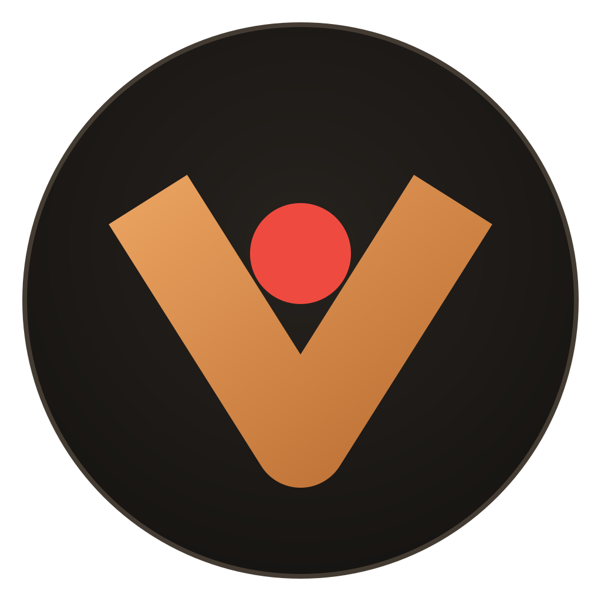
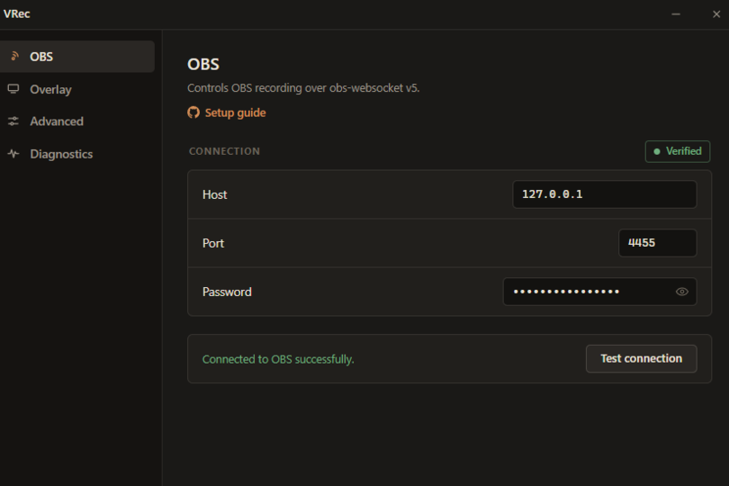
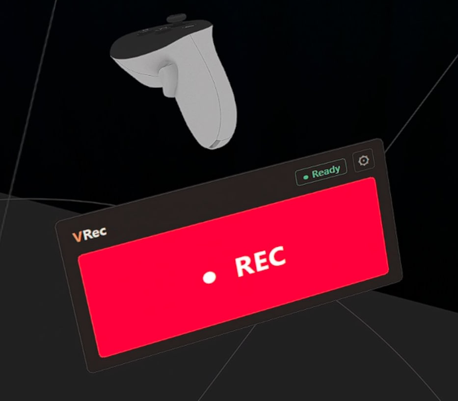

<div align="center">


# VRec
</div>

VRec connects SteamVR to OBS Studio, letting you start and stop recordings from a VR environment without taking off your headset.

## Screenshots

### Desktop



### VR overlay



## Requirements

- 64-bit Windows 10 or Windows 11
- SteamVR
- OBS Studio with its WebSocket server enabled
- Microsoft Edge WebView2 Runtime

The WebView2 Runtime is included with current Windows 11 installations. Microsoft
also provides a standalone installer for Windows 10.

## Installation

Extract the release archive and run vrec.exe. Keep the extracted files together.

## Connecting to OBS

1. In OBS, open **Tools > WebSocket Server Settings**.
2. Enable the WebSocket server.
3. Leave the port at `4455` unless another application already uses it.
4. Set or copy the server password.
5. In VRec, enter the host, port, and password on the **OBS** page.
6. Select **Test connection**.

Use `127.0.0.1` when OBS and VRec run on the same computer. A LAN address also
works when OBS is configured to accept connections from that interface.

## Usage

Start OBS, then VRec. In VR, toggle recording via overlay.

## Building

Install Visual Studio or Build Tools with the MSVC v145 toolset, the Windows SDK,
and the Desktop development with C++ workload. Then run:

```powershell
.\scripts\build-msvc.ps1 -Configuration Debug -Platform x64
.\scripts\build-msvc.ps1 -Configuration Release -Platform x64
```

`release-check.ps1` rebuilds the Release application and native tests, runs the
tests, packages `dist\VRec`, compares executable hashes, and validates the package
contents.

## Dependencies

- [OpenVR](https://github.com/ValveSoftware/openvr), BSD 3-Clause
- [Microsoft WebView2 SDK](https://developer.microsoft.com/microsoft-edge/webview2/), Microsoft software license
- [nlohmann/json 3.12.0](https://github.com/nlohmann/json/releases/tag/v3.12.0), MIT

The corresponding vendor license files are stored next to each dependency in
`third_party`.

## Support

VRec is a free open-source project. If it helped you, you can support development:

- DonationAlerts: <https://www.donationalerts.com/r/esfrick>
- Crypto:
  - USDT TRC20: `TRsfmfg9KrvapABqwpjnLfr6oxhmDsn48z`
  - TON: `UQCFKTLcOMgp_W27ny-fRxoyimyeCv-Uf6BTGa-LMERLWp_k`

## License

VRec is released under the GNU General Public License v3.0. See [LICENSE](LICENSE).
